# Tahap 1 — ERD & Skema Database

Skema lengkap: `prisma/schema.prisma`. Dokumen ini menjelaskan **kenapa**
skema tersebut berbentuk demikian — rasional per entitas, index, dan
constraint — supaya tidak ada keputusan yang implisit.

## ERD

Relasi audit murni (`createdBy`/`updatedBy` ke `User`) disederhanakan/
disembunyikan dari diagram agar tetap terbaca — setiap entitas beraudit
(`Department`, `Institution`, `Employee`, `Purpose`, `Guest`, `Setting`)
sebenarnya punya 1–3 FK tambahan ke `User` untuk itu (lihat kolom lengkap di
`schema.prisma`). Yang ditampilkan di sini adalah relasi domain inti.

```mermaid
erDiagram
    ROLE {
        uuid id PK
        string name UK "SUPER_ADMIN | ADMIN | RESEPSIONIS | KEPALA_DINAS"
        string description
    }

    USER {
        uuid id PK
        string name
        string email UK
        string passwordHash
        uuid roleId FK
        boolean isActive
        datetime lastLoginAt
    }

    DEPARTMENT {
        uuid id PK
        string name UK
        boolean isActive
    }

    INSTITUTION {
        uuid id PK
        string name UK
        string address
        string phoneNumber
        boolean isActive
    }

    EMPLOYEE {
        uuid id PK
        string name
        string nip UK
        string position
        uuid departmentId FK
        boolean isActive
    }

    PURPOSE {
        uuid id PK
        string name UK
        boolean isActive
    }

    GUEST {
        uuid id PK
        string queueNumber UK "YYYYMMDD-0001"
        string qrToken UK
        date visitDate
        datetime checkInTime
        datetime checkOutTime
        string fullName
        string nik
        enum gender
        string address
        string phoneNumber
        string email
        uuid institutionId FK
        uuid departmentId FK
        uuid employeeId FK
        uuid purposeId FK
        string visitDetail
        enum status
        text signatureImage "base64 PNG"
        string photoUrl "Vercel Blob URL"
        datetime deletedAt "soft delete"
    }

    DAILY_COUNTER {
        date date PK
        int lastValue
    }

    ACTIVITY_LOG {
        uuid id PK
        uuid userId FK
        enum action
        string entityType
        string entityId
        string description
        json metadata
        string ipAddress
        datetime createdAt
    }

    SETTING {
        uuid id PK
        string key UK
        string value
    }

    ROLE ||--o{ USER : memiliki
    DEPARTMENT ||--o{ EMPLOYEE : menaungi
    DEPARTMENT ||--o{ GUEST : "bidang tujuan"
    INSTITUTION ||--o{ GUEST : "instansi asal"
    EMPLOYEE |o--o{ GUEST : "pegawai ditemui (opsional)"
    PURPOSE ||--o{ GUEST : "kategori keperluan"
    USER |o--o{ GUEST : "audit trail (createdBy/updatedBy/deletedBy)"
    USER |o--o{ ACTIVITY_LOG : melakukan
    USER |o--o{ SETTING : mengubah
    DAILY_COUNTER ||--o{ GUEST : "sumber nomor antrian (bukan FK sungguhan)"
```



## Rasional Per Entitas

**Role** — tabel sungguhan (bukan Prisma enum murni) karena brief eksplisit
meminta tabel `roles`, dan agar deskripsi role bisa ditampilkan di UI
manajemen user. `name` tetap bertipe enum `RoleName` (bukan string bebas)
supaya keempat role tetap tertutup/exhaustive secara type-safe — sistem ini
tidak punya UI "buat role baru", jadi fleksibilitas string bebas tidak
diperlukan dan justru membuka celah salah ketik role di kode.

**User** — `isActive` menggantikan konsep hapus (§4.3 dokumen analisis).
`roleId` wajib (`onDelete: Restrict`) — user selalu punya tepat satu role,
tidak pernah tanpa role.

**Department / Institution / Purpose** — bentuk hampir identik: `name`
unik, `isActive` untuk nonaktifkan. `onDelete: Restrict` dari `Guest` (dan
dari `Employee` untuk `Department`) mencegah baris ini dihapus paksa selama
masih dipakai riwayat kunjungan.

**Employee** — satu-satunya master data dengan relasi wajib ke entitas lain
(`departmentId`, karena pegawai selalu berada di satu bidang). `name`
**sengaja tidak** `@unique` — nama orang bisa kembar di dunia nyata (dua
pegawai bernama sama, beda bidang, bukan hal aneh). Pengecekan duplikasi
tetap dilakukan (case-insensitive, di-scope ke `name + departmentId`) di
application layer sebagai **peringatan**, bukan penolakan keras — beda
dengan Department/Institution/Purpose yang penolakannya keras karena
representasi satu entitas dunia nyata yang sama secara konsep tidak boleh
dobel sama sekali.

**Guest** — entitas transaksional inti, lihat §4 `docs/01` untuk detail
setiap keputusan field (nomor antrian, QR token, retensi edit, dsb). Semua
FK ke master data pakai `onDelete: Restrict` **tanpa kecuali**, termasuk
`employeeId` yang nullable — supaya baris master data yang sudah pernah
"disebut" dalam riwayat kunjungan tidak bisa hard-delete dan diam-diam
membuat riwayat itu kehilangan konteks.

**DailyCounter** — bukan bagian dari domain bisnis yang terlihat user, murni
penopang teknis supaya generate nomor antrian atomik (lihat §"Nomor Antrian
Atomik" di bawah). Tidak punya kolom audit karena tidak pernah dilihat/
diubah manual oleh siapa pun.

**ActivityLog** — tidak ada `updatedAt`/`deletedAt` sama sekali karena
append-only by design; tidak ada jalur di aplikasi manapun yang mengubah
atau menghapus baris log.

**Setting** — key-value generik. Tipe `value` sengaja `String` (bukan
`Json`) supaya satu kolom bisa menyimpan skalar apa pun (angka, boolean,
teks) sebagai representasi string dan di-parse sesuai tipe yang diharapkan
tiap `key` di application layer — menghindari kebutuhan skema kolom berubah
tiap kali ada setting baru.

## Index

| Tabel | Index | Alasan |
|---|---|---|
| `guests` | `visitDate`, `status`, `institutionId`, `departmentId`, `employeeId`, `purposeId`, `fullName`, `createdAt`, `deletedAt`, composite `(visitDate, status)` | Semua kolom ini dipakai langsung sebagai filter/search di modul Buku Tamu & dashboard (§4/§5 brief) — composite `(visitDate, status)` mempercepat query paling umum: "tamu hari ini dengan status X" |
| `departments`, `institutions`, `purposes`, `employees` | `isActive` | Dropdown/autocomplete di form tamu selalu memfilter `isActive = true` |
| `employees` | `departmentId` | Filter pegawai per bidang di form tamu |
| `activity_logs` | `userId`, `action`, `(entityType, entityId)`, `createdAt` | Modul activity log (§11 brief) perlu difilter per user, jenis aksi, entitas terkait, dan diurutkan terbaru |
| `users` | `roleId`, `isActive` | Middleware & pengecekan login membaca role secara sering; user nonaktif difilter dari list |

**Catatan performa lanjutan (bukan bagian MVP)**: pencarian nama tamu
(`ILIKE '%kata%'`) tidak memanfaatkan btree index biasa secara optimal untuk
substring di tengah teks. Jika volume data membuat ini terasa lambat,
upgrade-nya adalah menambah ekstensi `pg_trgm` + index `GIN` di
`guests.full_name` — perubahan migration tambahan, tidak mengubah struktur
tabel yang sudah ada.

## Uniqueness Case-Insensitive (Department/Institution/Purpose)

Prisma `@unique` di PostgreSQL bersifat case-sensitive ("Dishub Kota" dan
"dishub kota" dianggap dua baris berbeda). Brief meminta validasi duplikasi
case-insensitive. Dua lapis pertahanan yang direncanakan:

1. **Application layer** (Tahap 3/4): use case create/update melakukan
   `findFirst({ where: { name: { equals: input.name, mode: 'insensitive' } } })`
   sebelum insert/update, mengembalikan error tervalidasi Zod jika ditemukan.
   Ini jalur utama yang memberi pesan error jelas ke UI.
2. **Database layer** (defense-in-depth, ditambahkan manual ke migration
   pertama di Tahap 2 karena Prisma schema tidak punya sintaks native untuk
   functional unique index tanpa mengaktifkan preview feature):

   ```sql
   CREATE UNIQUE INDEX departments_name_lower_idx ON departments (LOWER(name));
   CREATE UNIQUE INDEX institutions_name_lower_idx ON institutions (LOWER(name));
   CREATE UNIQUE INDEX purposes_name_lower_idx ON purposes (LOWER(name));
   ```

   Ini memastikan race condition (dua request create bersamaan dengan nama
   sama tapi beda kapital) tetap gagal di level database walau lolos
   pengecekan application-layer.

## Nomor Antrian Atomik

Race condition dua resepsionis submit bersamaan dihindari dengan satu query
atomik ke `daily_counters`, bukan pola "baca nilai terakhir lalu +1" yang
rentan tumpang tindih:

```sql
INSERT INTO daily_counters (date, last_value)
VALUES ($1, 1)
ON CONFLICT (date)
DO UPDATE SET last_value = daily_counters.last_value + 1
RETURNING last_value;
```

`$1` = tanggal hari ini pada `APP_TIMEZONE` (§4.11 `docs/01`). Nilai yang
dikembalikan langsung dipakai untuk membentuk `20260722-0007` dst. Dieksekusi
lewat `prisma.$queryRaw` di `daily-counter.repository.ts` (Tahap 3) — satu-
satunya raw query yang disengaja di seluruh sistem, karena Prisma tidak
punya primitif atomic-increment-with-upsert bawaan yang race-safe untuk
kasus ini.

## onDelete — Ringkasan Kebijakan

Satu kalimat yang berlaku untuk **seluruh** relasi di skema ini: **tidak ada
data yang boleh hilang diam-diam lewat cascade atau ter-null otomatis**.
Semua `onDelete` diset eksplisit ke `Restrict` — baris hanya berhenti aktif
lewat `isActive = false` (master data/user) atau `deletedAt` (tamu), tidak
pernah lewat hard delete selama masih direferensikan di mana pun. Ini
berlaku bahkan untuk FK yang nullable (mis. `Guest.employeeId`), karena
"boleh kosong saat dibuat" dan "boleh dihapus paksa setelah dipakai" adalah
dua hal yang berbeda.

`onUpdate` tidak di-override (default Prisma) karena seluruh primary key di
skema ini adalah UUID yang immutable setelah dibuat — perilaku `onUpdate`
tidak pernah benar-benar teruji dalam praktik.
